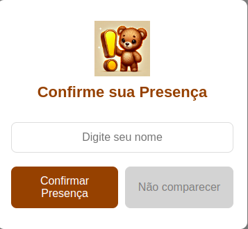

# 🍼 Site para o Chá de Fraldas

Este projeto visa criar um site intuitivo e agradável para o chá de fraldas, com foco em uma experiência amigável para todos os convidados. O site será desenvolvido com uma interface moderna, acessível e alinhada ao tema do evento, incluindo funcionalidades como confirmação de presença e informações detalhadas sobre o evento.

## 🎯 Objetivo

Desenvolver um site para o Chá de Fraldas com o objetivo de:

- Proporcionar uma navegação fácil e intuitiva.
- Permitir aos convidados confirmar sua presença de forma rápida e simples.
- Apresentar informações sobre o evento, incluindo cardápio, presentes e localização.
- Oferecer uma experiência de usuário envolvente e acolhedora, especialmente para quem não tem familiaridade com navegação web.

## 👨‍💻 Programadores

- **Luiz** (Programador) 🧑‍💻
- **Joana** (Designer) 🎨

## 📸 Imagens

Aqui está um exemplo de como o pop-up de confirmação de presença está sendo desenvolvido:



## 🔗 Links Úteis

- **Figma**: [Link para o Figma](#)
- **Reuniões e Atas**: [Link para as atas de reuniões](./Reuniões/pdf/)

## 🛠️ Ferramentas Utilizadas

- **Frontend**: React
- **Backend**: Node.js
- **Design**: Figma
- **Controle de Versão**: Git/GitHub
- **Banco de Dados**: MongoDB

## 📌 Estrutura do Projeto

Este projeto é composto pelas seguintes páginas e funcionalidades:

1. **História** – Seção para compartilhar a história dos pais e do bebê.
2. **Convite** – Convite formal com todos os detalhes do evento.
3. **Sumário** – Visão geral do site e introdução ao evento.
4. **Fotos** – Galeria de fotos relacionadas ao bebê e à família.
5. **Cardápio** – Exibição dos itens de alimentação do evento.
6. **Presentes** – Lista de sugestões de presentes para os convidados.
7. **Confirmação de Presença** – Seção para os convidados confirmarem sua presença.
8. **Local, Data e Hora** - Seção para informar os detalhes da localização e momento do evento

## ✅ Trabalhos Pendentes

- [ ] **Decidir ordem das páginas** (07/11)
- [ ] **Decidir estilo do Sumário** (09/11)
- [ ] **Finalizar primeiro protótipo do Popup (Funcional)** (11/11)
- [ ] **Wireframe Inicial** (14/11)
- [ ] **Adicionar Página de "Local e Horário"** (07/11)

## 📋 Como Rodar o Projeto

### 1. Clonar o Repositório

```bash
git clone https://github.com/usuario/cha-de-fraldas.git
```

### 2. Instalar Dependências

> No diretório do projeto, instale as dependências para o frontend e o backend:

**Frontend**:

```bash
cd frontend
npm install
```

**Backend**:

```bash
cd backend
npm install
```

### 3. Rodar o Projeto

> Para rodar o frontend e backend simultaneamente:

```bash
cd frontend
npm start
```

```bash
cd backend
npm start
```

> Isso iniciará os servidores de desenvolvimento para o frontend e backend.
